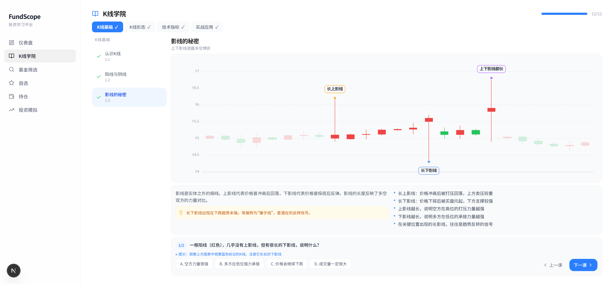
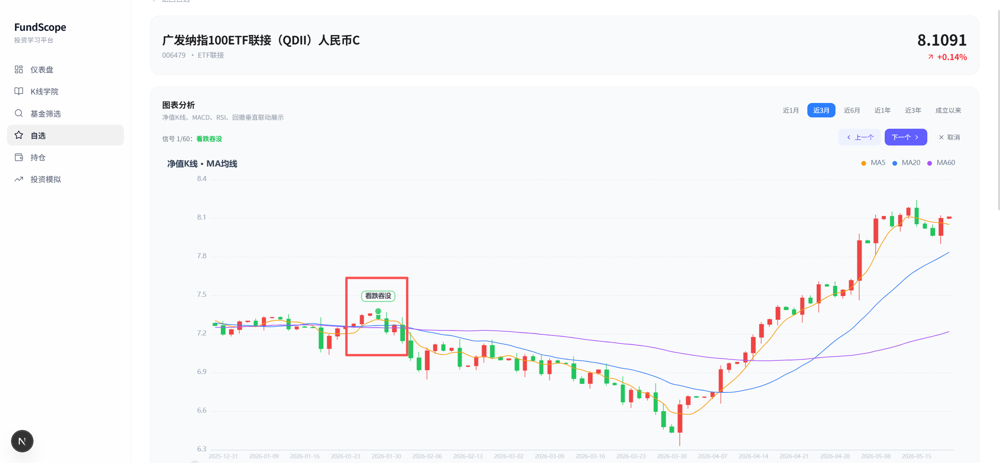
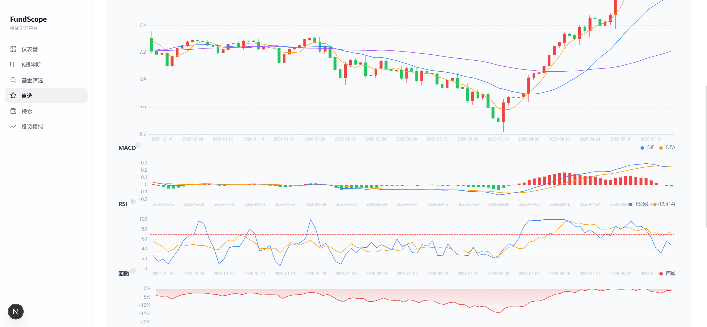

# FundScope

## 快速启动

从 GitHub 拉取后，优先按下面的方式跑起来：

```bash
git clone https://github.com/qqqqzh/fundscope.git
cd fundscope
```

Windows：

```powershell
.\start-dev.cmd -OpenBrowser
```

macOS / Linux：

```bash
bash scripts/start-dev.sh --open
```

脚本会在首次运行时安装前端依赖、创建 `backend/.venv`、安装后端依赖，并同时启动：

- 前端：<http://localhost:3000>
- 后端：<http://localhost:8000>

如果你想手动启动、部署到服务器，或配置远程后端，请看 [部署与运行教程](docs/DEPLOYMENT.md)。

> 🌱 一个给投资小白用来建立分析基础、从真实 K 线学习的基金观察台。  
> 💡 不负责让你一夜暴富，负责让你慢慢建立分析基础。

FundScope 是一个面向新手投资者的轻量级学习工具。它把 K 线学习、真实走势关键信号寻找、AI 辅助分析等内容放在一个地方，目标不是替你下判断，而是帮你慢慢建立自己的观察习惯。

如果你刚开始接触基金，常见状态可能是：

- 😵 看见涨跌就紧张，但不知道该看哪些指标，也没有技术基础
- 📚 想学一点技术分析，但又不想一上来就被术语劝退
- 🧭 想要循序渐进地奠定自己的分析思维

这个项目就是拿来解决这些“小白第一阶段问题”的。

## ✨ 它现在能做什么

- `K线学院`：快速学会 K 线基础，帮助你打底子
- `基金详情`：自选后自动标记关键信号，结合 AI 分析做真实 K 线学习
- `持仓管理`：记录持仓后，辅助分析当前配置
- `投资模拟`：🚧 待开发
- `通用助手`：🚧 待开发
- `相关资讯`：🚧 待开发

## 🖼️ 页面预览

### K线学院



### 关键点标注



### 多指标对比



## 🎯 这个项目更适合谁

- 👶 刚开始学基金和指数投资的人
- 📝 想把“随便投”变成“有分析地投”的人
- 🔍 想先建立观察体系，再考虑更复杂策略的人

## 🚫 当前版本不做什么

- 不提供自动交易
- 不提供收益承诺
- 不替你做买卖决策
- 不做云端同步和账户系统
- 不做真正完整的投资模拟和组合回测

目前它更像是一个“投资学习操作台”，不是一个“替你赚钱的黑盒”。

## 🛠️ 技术栈

- 前端：Next.js 16、React 19、TypeScript、Tailwind CSS 4
- 图表：ECharts、`echarts-for-react`
- 后端：FastAPI、AkShare、Pandas
- 数据存储：
  - 行情和基金数据由后端接口聚合
  - 自选与持仓通过浏览器 `localStorage` 持久化

## 🧱 项目结构

```text
fundscope/
├── backend/                  # FastAPI 后端，负责基金/指数数据聚合
├── docs/readme-assets/       # README 截图资源
├── src/
│   ├── app/
│   │   ├── academy/          # K 线学院
│   │   ├── api/              # Next.js BFF 路由，转发后端接口
│   │   ├── backtest/         # 投资模拟（待开发）
│   │   ├── fund/[code]/      # 基金详情
│   │   ├── funds/            # 基金筛选与搜索
│   │   ├── holdings/         # 持仓管理
│   │   └── watchlist/        # 自选与自选详情
│   ├── components/layout/    # 布局与侧边导航
│   ├── data/                 # 示例数据
│   ├── lib/                  # 本地状态与工具逻辑
│   └── types/                # 类型定义
├── package.json
└── README.md
```

## 🚀 本地启动

### 1. 启动前端

```bash
npm install
npm run dev
```

默认地址：

- 前端：[http://localhost:3000](http://localhost:3000)

### 2. 启动后端

建议使用 Python 3.11+：

```bash
python -m venv backend/.venv
backend/.venv/Scripts/activate
pip install -r backend/requirements.txt
python backend/main.py
```

默认地址：

- 后端：`http://localhost:8000`

## 🔄 数据怎么流动

1. 前端页面先请求 Next.js 的 `src/app/api/*` 路由
2. 这些路由再转发给 FastAPI 后端
3. FastAPI 使用 AkShare 拉取基金、ETF、指数和净值数据，并做简单缓存与加工
4. 自选与持仓数据保存在浏览器本地，不依赖数据库

## 📌 版本边界

`v0.1.0` 更适合作为“可本地运行、可公开展示、可继续打磨”的首个版本：

- 自选和持仓使用浏览器本地存储，换设备不会自动同步
- 后端数据依赖外部行情源，首次拉取或网络异常时可能较慢
- 投资模拟模块目前只有占位页，后续再决定具体产品形态

## ☕ 小提醒

这不是投资建议工具。  
它更像一个认真一点的学习笔记本，帮你把“看热闹”慢慢变成“看门道”。

## 📚 Changelog

版本记录见 [CHANGELOG.md](./CHANGELOG.md)。
